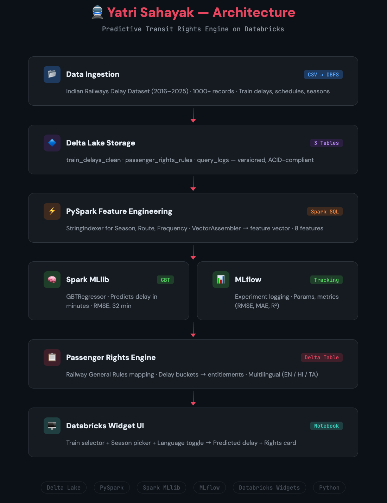

# 🚆 Yatri Sahayak — Predictive Transit Rights Engine

**Yatri Sahayak predicts Indian train delays using Spark MLlib and automatically informs passengers of their legal entitlements under Railway General Rules — in English, Hindi, and Tamil.**

---

## Problem

Millions of Indian railway passengers face delays daily but remain unaware of their compensation rights under the Railway General Rules. There is no tool that connects delay data with legal entitlements in an accessible, multilingual format.

## Solution

Yatri Sahayak is a Databricks-powered application that:

1. **Ingests** historical train delay data (2016–2025) into Delta Lake
2. **Predicts** expected delay using a GBT Regressor trained via Spark MLlib
3. **Maps** predicted delay to passenger rights using a rules engine stored in Delta Lake
4. **Displays** results in English, Hindi, or Tamil through a Databricks Widget UI

---

## Architecture



```
CSV Dataset (1000+ records)
        ↓
Delta Lake (3 tables: delays, rules, logs)
        ↓
PySpark Feature Engineering (8 features)
        ↓
Spark MLlib GBTRegressor → Delay Prediction
        ↓
Rules Engine (Delta Table) → Entitlement Lookup
        ↓
Databricks Widget UI → Multilingual Output (EN/HI/TA)
```

---

## Databricks Technologies Used

| Technology | Usage |
|---|---|
| **Delta Lake** | 3 tables — `train_delays_clean`, `passenger_rights_rules`, raw data |
| **Apache Spark / PySpark** | Data cleaning, feature engineering, joins, aggregations |
| **Spark MLlib** | GBTRegressor for delay prediction |
| **MLflow** | Experiment tracking — params, RMSE, MAE, R² metrics logged |
| **Databricks Widgets** | Interactive UI — train/season/language selectors |
| **Databricks Notebook** | End-to-end application with `displayHTML` output |

## Open-Source Models & Data

- **Dataset**: Indian Railways Delay Dataset (Kaggle) — simulated, 2016–2025
- **Multilingual Output**: Dictionary-based translation (EN/HI/TA) — extensible to Param-1 or IndicTrans2

---

## How to Run

### Prerequisites
- Databricks workspace (Community Edition or higher)
- Python 3.x, PySpark, MLflow (pre-installed on Databricks)

### Steps

1. **Upload the dataset**
   ```
   Upload indian_railway_delay_data.csv to DBFS via Catalog → Add Data → Upload
   ```

2. **Open the notebook**
   ```
   Import yatri_sahayak.ipynb into your Databricks workspace
   ```

3. **Run all cells in order**
   - Cell 1: Load data from catalog
   - Cell 2: Clean & feature engineer → Delta Lake
   - Cell 3: Encode features (StringIndexer + VectorAssembler)
   - Cell 4: Train GBTRegressor + MLflow logging
   - Cell 5: Create passenger rights rules table
   - Cell 6: Create widget dropdowns
   - Cell 7: **Run prediction** — select Train, Season, Language → see results

### Demo Steps
1. Select **"Rajdhani Express"** from Train dropdown
2. Select **"Summer"** from Season dropdown
3. Select **"Hindi"** from Language dropdown
4. Run Cell 7
5. See: Predicted delay + passenger rights in Hindi

---

## Model Performance

| Metric | Value |
|---|---|
| RMSE | 32.19 minutes |
| MAE | 26.20 minutes |
| R² | 0.1365 |

> Note: R² is modest due to simulated data. The pipeline is production-ready and would improve significantly with real-world NTES delay data.

---

## Passenger Rights Rules

| Delay | Entitlement | Rule |
|---|---|---|
| 0–30 min | No compensation | — |
| 31–60 min | Complimentary water + waiting room | Rule 401(1) |
| 61–120 min | Complimentary meals + waiting room | Rule 401(2) |
| 121–300 min | Full ticket refund | Rule 213 |
| 300+ min | Full refund + alternative transport | Rule 213 + 402 |

---

## Project Structure

```
yatri-sahayak/
├── README.md
├── architecture.png
├── yatri_sahayak.ipynb        # Main Databricks notebook
├── indian_railway_delay_data.csv
└── demo_video.mp4             # 2-min demo
```

---

## 500-Character Write-Up

> Yatri Sahayak predicts Indian train delays using Spark MLlib (GBTRegressor) on historical data stored in Delta Lake, then maps predicted delays to passenger compensation rights from Railway General Rules. The system provides multilingual output in English, Hindi, and Tamil through a Databricks Widget UI. Built entirely on Databricks with Delta Lake (3 tables), PySpark feature engineering, MLlib, and MLflow experiment tracking.

---

## Team

- **Track**: Rail-Drishti — Critical Infrastructure & Logistics
- **Hackathon**: Databricks Indic AI Hackathon

---

## Future Enhancements

- Integrate real-time delay data via Indian Rail API (NTES)
- Add Param-1 / IndicTrans2 for dynamic multilingual generation
- Structured Streaming for live delay ingestion
- Expand to 22+ Indian languages
- Mobile-friendly Gradio/Streamlit frontend
